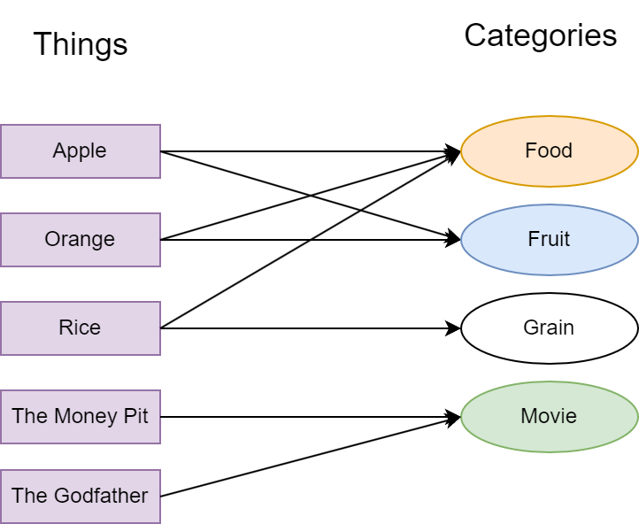
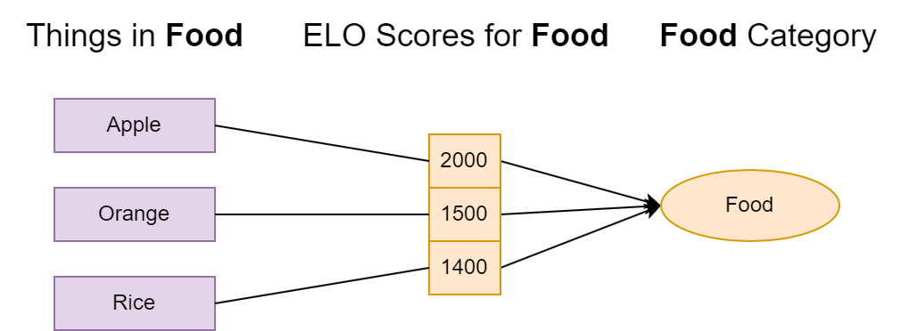
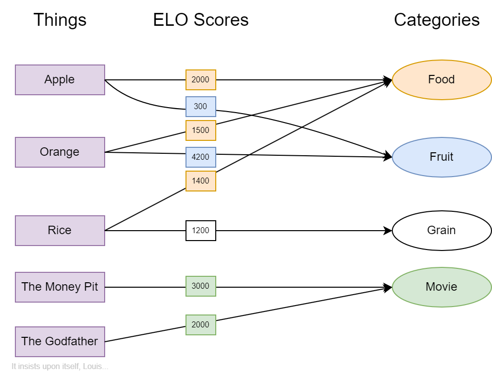

# Rankit

An ELO rating site where users can rate **Things** under **Categories**.

The goal of this site is to provide an objective rating system for movies, games, food, actors and anything else using the [ELO rating system](https://en.wikipedia.org/wiki/Elo_rating_system). The ELO rating system originates from chess where players have a numerical score denoting their skill level. When two players face off, the winner gains points and the loser loses points. How much is gained and lost depends on each player's respective ELO score.

This site incorporates this idea by polling its users. Users will pick a **Category** and request to be polled. The site will then prompt the user with images of two randomly selected **Things** that belong to the **Category** selected. The user then chooses their preference and the ELO scores of each **Thing** will update. They'll then be shown how their choice differed from others.

Here is a zoom-in of the food category:

In this category, apple is ranked the highest. The story might be different in other categories, though. Here is a more detailed diagram:

In the fruit category, orange reigns supreme. This sort of outcome is uncommon, but certainly possible.

# Accounts
People visiting the site anonymously can read polling data, but cannot participate in polls. One must register an account to do so. This is done to mitigate spam. Accounts can have one of the following roles: **Basic**, **Admin** and **Root**.

* **Basic** accounts can read polling data participate in polls.

* **Admin** inherits from **Basic** and can create new **Things**, **Categories** and **Ranks** (scored associations of **Things** and **Categories**).

* **Root** inherits from **Admin** and can set the roles of other accounts. There is always exactly one root user which is created the first time the API server starts. 
